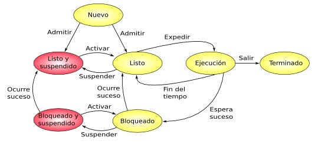

# Ejecución de Procesos

-- Cuando un proceso obtiene el control de la CPU, comienza su ejecución. La CPU ejecuta instrucciones del programa, accede a datos en la memoria y realiza operaciones según lo especificado en el código fuente del programa.

-- El estado del proceso pasa de "listo" a "en ejecución". Durante este tiempo, el proceso puede realizar cálculos, interactuar con el usuario o realizar operaciones de entrada/salida

  

 

