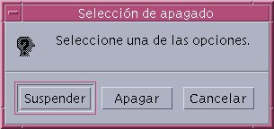

# Suspensión y Reanudación

-- Un proceso puede ser suspendido cuando está a la espera de recursos, como datos de entrada/salida, o cuando se encuentra en un estado de espera.

-- La reanudación ocurre cuando los recursos necesarios están disponibles o cuando se cumple una condición específica que permite al proceso continuar su ejecución

  

 

