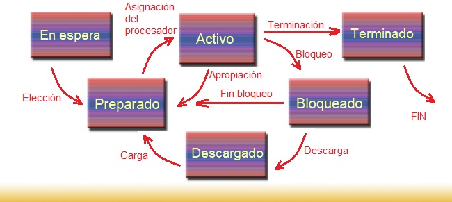

# Terminación de Procesos

-- Cuando un proceso termina su ejecución, el sistema operativo libera los recursos asociados con ese proceso. Esto incluye liberar la memoria asignada, cerrar archivos abiertos y liberar cualquier otro recurso adquirido durante la ejecución.

-- El sistema operativo también actualiza la información del proceso y notifica al programa principal o al usuario sobre la finalización del proceso.

  <a href="https://1984.lsi.us.es/wiki-ssoo/index.php/Estados_de_los_procesos">
  
   
Esta imagen esta propocionado desde Wikipedia.

 

[REGRESAR](../README.md)
