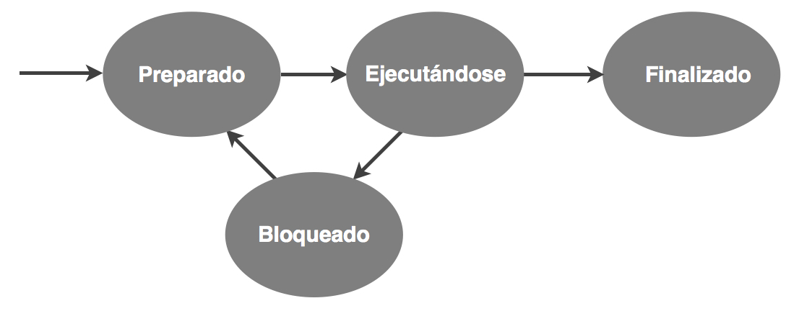

# Gestión de Propiedades y Políticas

-- Los sistemas operativos a menudo implementan políticas de planificación que asignan prioridades a los procesos. Estas políticas pueden ser basadas en prioridades estáticas o dinámicas, dependiendo de la importancia y la urgencia de las tareas.

-- Las políticas pueden ser ajustables para adaptarse a diferentes cargas de trabajo y requisitos del sistema, optimizando así el rendimiento y la eficiencia general del sistema operativo.

  
   
  Esta imagen esta propocionado de una pagina web.

