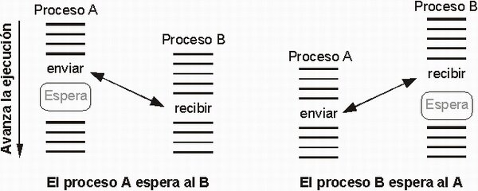

# Planificación y Comunicación
-- La sincronización entre procesos es esencial para evitar problemas como las condiciones de carrera y garantizar la coherencia de los datos compartidos.

-- Mecanismos como semáforos, mutex (exclusión mutua) y colas son utilizados para coordinar la ejecución de los procesos y asegurar la integridad de los datos compartidos entre ellos.

  

 

[REGRESAR](../01_introduccion.md)